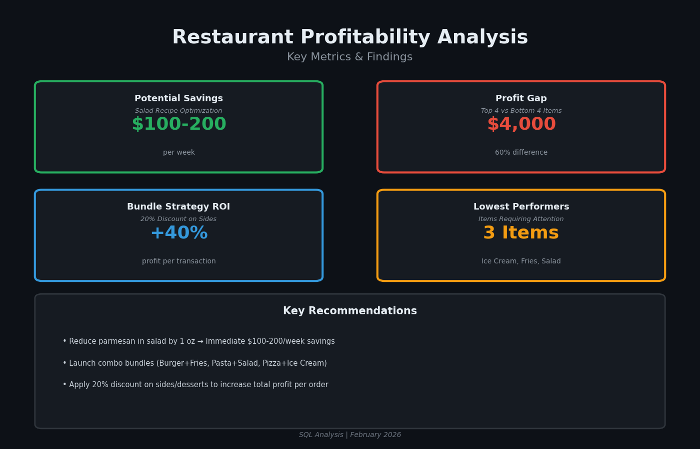
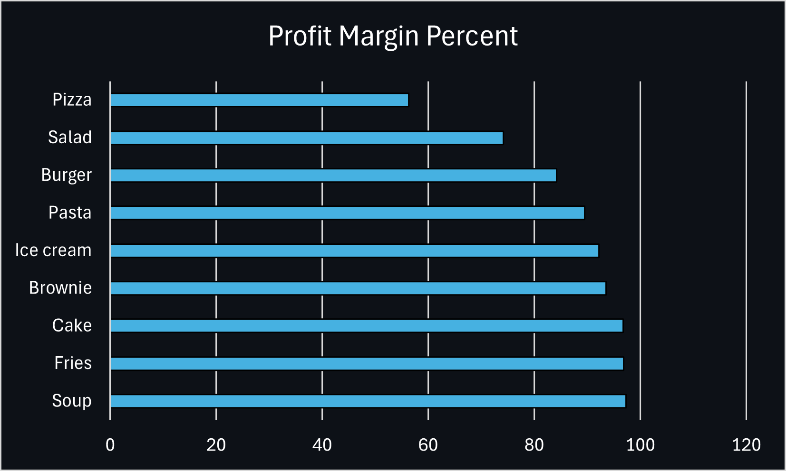
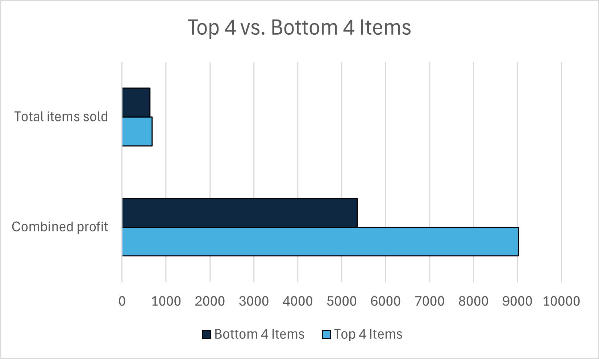
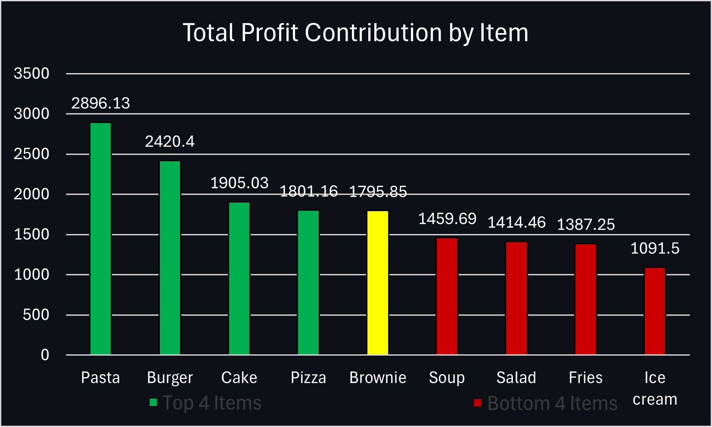
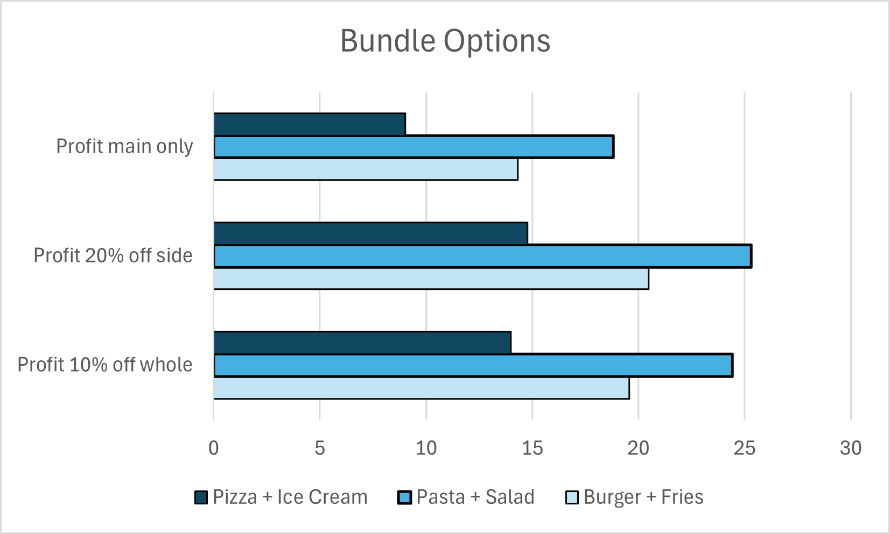

# Restaurant Profitability Analysis



## What This Project Does

I analyzed a struggling restaurant's menu data to figure out why they're losing money despite having low-cost items. Through SQL analysis of ingredient costs, recipes, and sales transactions, I found the root causes and built a strategy to increase profits by 40%.

## The Problem

The restaurant should be profitable—they've got cheap menu items and decent foot traffic. But they're still in the red. Something wasn't adding up, so I dug into their data to find out what.

## Tools I Used

- **SQLite** - All the data analysis, joins, CTEs, and calculations
- **Python (Matplotlib)** - Built the metrics dashboard
- **Excel** - Created comparison charts and tested scenarios
- **DB Browser** - Query testing and validation
- **Git** - Version control

## How I Approached It

I started by cleaning up the data (there were some encoding issues with the menu IDs—more on that in the [data dictionary](DATA_DICTIONARY.md)). Then I:

1. Calculated the actual cost to make each dish using the bill of materials
2. Figured out profit margins for every menu item
3. Looked at which items were actually selling
4. Found the expensive ingredients dragging down margins
5. Compared top performers against bottom performers
6. Tested different bundle pricing strategies

The full step-by-step process is in my [analysis walkthrough](analysis.md).

## What I Found

### Pizza and Salad Have Terrible Margins



Pizza comes in at 56% margin and Salad at 74%—way below everything else on the menu. Pizza gets away with it because people order it constantly. Salad doesn't.

**See the query:** [`01_profit_margin_analysis.sql`](sql/01_profit_margin_analysis.sql)

### There's a Massive Gap Between Winners and Losers



The top 4 items generate $9,023 in profit. The bottom 4? Just $5,353. That's a **$3,670 gap** (60% difference) with roughly the same number of orders. The problem isn't foot traffic—it's what people are ordering and how much profit each item makes.

**See the query:** [`05_top_bottom_performer.sql`](sql/05_top_bottom_performer.sql)

### Sides and Desserts Are Killing Profits



Mains (Pasta, Burger, Cake, Pizza) are carrying the whole operation. Sides and desserts are dead weight:
- Ice Cream costs too much to make and barely sells
- Fries sell well but only make $7.75 profit per order
- Salad has both problems—expensive to make AND nobody orders it

**See the query:** [`04_profit_contribution.sql`](sql/04_profit_contribution.sql)

### Parmesan Is Destroying the Salad

Parmesan costs $1.25 per salad—that's 65 cents more than any other ingredient. When you're selling one of the lowest-volume items on the menu and it costs that much to make, you've got a problem.

**See the query:** [`03_salad_cost_breakdown.sql`](sql/03_salad_cost_breakdown.sql)

### Bundle Pricing Actually Works



I tested two discount strategies: 10% off both items vs. 20% off just the side/dessert. The 20% approach wins every time:

- Burger + Fries: $20.47 profit (vs $19.57 with 10% off both)
- Pasta + Salad: $25.31 profit (vs $24.41)
- Pizza + Ice Cream: $14.78 profit (vs $13.98)

That's a 40% profit increase per transaction compared to just selling mains alone. Plus it moves the inventory that's currently sitting there not making money.

**See the query:** [`06_discount_options.sql`](sql/06_discount_options.sql)

## What They Should Do

### Fix the Salad (Quick Win)

Cut the parmesan by 1 oz or switch to a parmesan vinaigrette. That saves $0.62–$1.00 per salad, which adds up to **$100-200/week** with their current volume. Easy change, immediate impact.

### Launch Bundle Deals (Long-Term Strategy)

Create three combos:
- Burger + Fries
- Pasta + Salad  
- Pizza + Ice Cream

Give 20% off the side/dessert (not both items). This drives 40% more profit per order while moving the underperformers. People think they're getting a deal, the restaurant makes more money, and those sides/desserts finally start moving.

### Market Better

Put up bigger displays for the salad. Feature the bundles prominently. The data shows people will buy these items if they're pushed—they're just not choosing them on their own right now.

## The Numbers

| What | How Much | Impact |
|------|----------|--------|
| Salad fix savings | $100-200/week | Immediate |
| Profit gap (top vs bottom) | $3,670 | Shows the opportunity |
| Bundle strategy boost | +40% per order | Long-term growth |
| Problem items | 3 (Ice Cream, Fries, Salad) | Need attention |

## Project Files
```
Restaurant_Data_Study/
├── README.md                    # You're reading it
├── analysis.md                  # Full walkthrough of my process
├── DATA_DICTIONARY.md           # Database structure and issues
├── sql/                         # All queries
│   ├── 01_profit_margin_analysis.sql
│   ├── 02_quantity_and_revenue.sql
│   ├── 03_salad_cost_breakdown.sql
│   ├── 04_profit_contribution.sql
│   ├── 05_top_bottom_performer.sql
│   └── 06_discount_options.sql
├── results/                     # Query outputs (CSV)
└── visualizations/              # Charts and dashboard
    ├── metrics_dashboard.png
    ├── profit_margin_percent.png
    ├── top_vs_bottom_4_items.png
    ├── total_profit_contribution_by_item.png
    └── bundle_options.png
```

## Skills This Project Shows

- Writing complex SQL (multi-table joins, CTEs, subqueries, aggregations)
- Root cause analysis—finding the real problem, not just symptoms
- Translating technical findings into business recommendations
- Data visualization that actually tells a story
- Critical thinking about data quality (see the data dictionary for my critique of the schema)

## Contact

**Ryan Bingham**  
[LinkedIn](#) | [GitHub](https://github.com/RyanBingham334) | ryanbingham3349@gmail.com

---

*This project is available for educational and portfolio purposes.*
